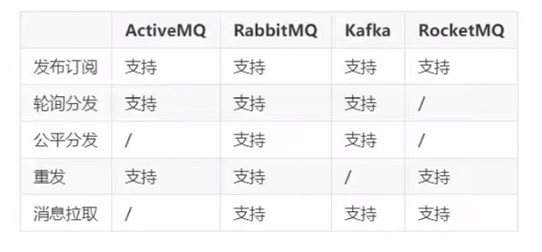

## RabbitMQ

activemq, rabbitmq, kafka, rocketmq

使用场景

- 跨系统数据传递
- 高并发流量削峰
- 数据的分发和异步处理
- 大数据分析与传递
- 分布式事务


AMQP (advanced message queuing protocol) 高级消息队列协议


### 消息分发策略



高可靠 高可用


### docker

```shell
docker pull rabbitmq

docker run -di --name my-rabbitmq -e RABBITMQ_DEFAULT_USER=admin -e RABBITMQ_DEFAULT_PASS=admin -p 15672:15672 -p 5672:5672 -p 25672:25672 -p 61613:61613 -p 1883:1883 rabbitmq
docker run -di --name my-rabbitmq -p 15672:15672 rabbitmq

# 开启图形化界面
docker exec -it my-rabbitmq /bin/bash
rabbitmq-plugins enable rabbitmq_management
# 访问 http://localhost:15672/

# 处理 Management API returned status code 500
cd /etc/rabbitmq/conf.d/
echo management_agent.disable_metrics_collector = false > management_agent.disable_metrics_collector.conf
exit
# 重启容器

docker logs -f my-rabbitmq
docker rm 容器id
```


### 角色分类

- none

- management

  查看自己相关节点信息

- policymaker

  包含 management 所有权限

  查看创建删除自己的 virtural hosts 所属的 policies 和 parameters 信息

- monitoring

- administrator

  最高权限


### 核心组件

- server
- connection
- channel
- message
- virtual host
- exchange
- bindings
- routing key
- queue


### 工作模式

[官网地址](https://www.rabbitmq.com/getstarted.html)

- 简单 (simple)
- 工作 (work)
- 发布订阅 (publish/subscribe)
- 路由 (routing)
- 主题 (topic)


exchanger 交换机

- direct：可以使用 routing key
- fanout：直接发送
- headers
- topic：# 0或多级，*一级


轮询分发 (work，均分)

公平分发，必须手动应答 (响应快消费的多)

